<p align="center">
  
</p>
<h1 align="center">欢迎使用 Codex Manager 👋</h1>
<p align="center"><strong>你的 Codex 管理中心</strong></p>
<p align="center">账号随设备流转，让会话、记忆、工具和主题各就其位。</p>
<p align="center">
  <a href="https://github.com/pen9un/codex-manager"></a>
  
  <a href="LICENSE"></a>
  <a href="https://github.com/pen9un/codex-manager/actions/workflows/ci.yml"></a>
</p>
<p align="center">
  <a href="#features">功能与演示</a> ·
  <a href="#account-sharing">账号共享</a> ·
  <a href="#quick-start">快速开始</a> ·
  <a href="#faq">常见问题</a> ·
  <a href="https://github.com/pen9un/codex-manager/issues">反馈建议</a>
</p>

**Codex Manager** 是面向 OpenAI Codex 的本地桌面管理工具。集中管理多个账号，导出本机登录并在其他终端复用，查看用量，把有价值的对话整理成 Markdown，再为日常开发准备好记忆、提示词、MCP、Skills 和喜欢的主题。

> Codex 多账号管理 · Codex 账号共享与切换 · ChatGPT 账号的 Codex 登录导入导出 · 用量与剩余额度查询 · 会话管理与 Markdown 导出 · 记忆管理 · 提示词模板 · MCP 配置 · Skills 管理 · 主题换肤

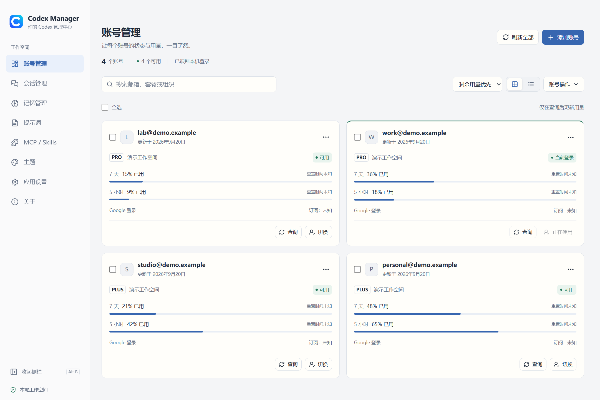

<p align="center"><sub>本页软件截图均由真实应用页面加载合成数据生成。邮箱、账号、额度、项目、会话和记忆均为虚构；主题效果来自应用内的隔离预览。</sub></p>

<a id="features"></a>

## 🌟 一个工作台，整理你的 Codex 日常

| 你想做的事 | Codex Manager 提供的入口 |
| --- | --- |
| 把本机登录的账号带到其他终端使用 | **账号导入导出**：读取本机登录，预览后保存，按需选中导出 |
| 管理多个账号，找到当前还有额度的账号 | **账号工作台**：状态、用量、搜索、排序、卡片与列表、账号切换 |
| 回看一个项目的开发过程，整理交接材料 | **会话管理**：项目分组、消息浏览、四档 Markdown 导出 |
| 看清 Codex 留下了哪些本地记忆 | **记忆管理**：分类、全文搜索、阅读编辑、备份恢复 |
| 把好用的工作指令保留下来 | **提示词**：模板、编辑预览、历史版本、导入导出 |
| 集中维护工具和技能配置 | **MCP / Skills**：配置编辑、启停、导入导出与备份 |
| 为 Codex 换一个喜欢的工作环境 | **主题馆**：20 组主题、40 种明暗外观、预览与备份恢复 |

<a id="account-sharing"></a>

## 🔄 账号共享与跨终端复用

**本机已经登录的 Codex / ChatGPT 账号，可以通过 Codex 登录凭据导出，在其他终端导入使用。** 适合在台式机、笔记本或其他受信任设备之间迁移账号，也能向你允许使用该账号的人交接凭据。

不用手动寻找、复制和覆盖认证文件：导入本机登录、检查预览、选择导出、在目标终端导入，均可在界面中完成。

| 步骤 | 原终端 | 目标终端 |
| --- | --- | --- |
| ① 获取账号 | 先在 Codex 客户端完成登录；打开管理器的 **账号操作 → 导入本机登录** | — |
| ② 确认导入 | 查看新增、更新及跳过条目，点击 **确认导入** | — |
| ③ 导出与传递 | 勾选需要共享的账号，点击 **导出**，将 JSON 文件传递给目标设备 | 接收账号 JSON 文件 |
| ④ 导入并使用 | — | 打开 **账号操作 → 导入 JSON 文件**，确认预览，再点击账号卡片上的 **切换** |

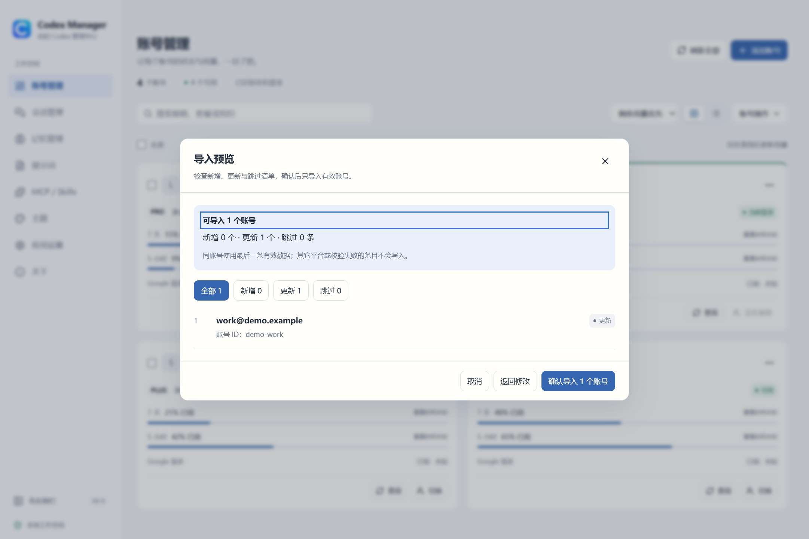

支持 **Codex `auth.json`、账号 JSON 数组、Sub2API 与 Codex2API 的兼容导出结构**；重复账号会合并更新，不同平台或无效条目会在预览中给出跳过原因。

> 导出文件包含完整登录凭据，应按密码级别保管，仅交给受信任的接收方。这里迁移的是 **ChatGPT 账号用于 Codex 的认证信息**，不包含 ChatGPT 网页 Cookie，也不会同步聊天记录。共享后使用的仍是同一账号的权益和额度；凭据失效时，需要在原客户端重新登录并导入最新数据。

## 📊 多账号管理与用量查询

把账号状态与用量放在同一张卡片上，减少反复切换查看的操作。

- **集中管理**：展示邮箱、套餐、组织、登录状态和订阅信息；信息是否完整取决于导入数据。
- **快速找到账号**：按邮箱、套餐或组织搜索，按剩余用量、添加时间或订阅到期时间排序。
- **查看额度**：展示接口返回的用量窗口、已用比例和重置时间，支持单个查询、刷新全部和定时更新。
- **切换与整理**：标记当前登录，支持账号切换、选中导出和批量移除。
- **按习惯布局**：卡片或列表，浅色、深色、跟随系统或高对比度。

<details>
<summary>🌙 查看深色账号工作台</summary>

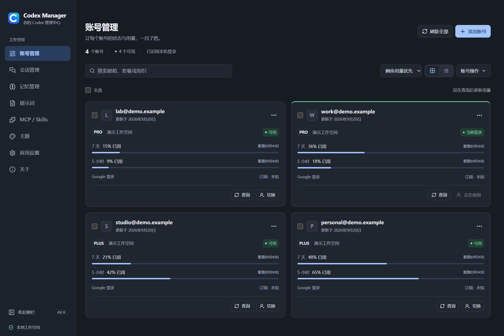

</details>

## 💬 会话管理，把开发过程变成可复用文档

按照 **项目 → 会话 → 消息** 浏览本地历史，支持搜索、分栏调整和长会话分页读取。整理需求、复盘实现、交接任务时，可以直接导出 Markdown。

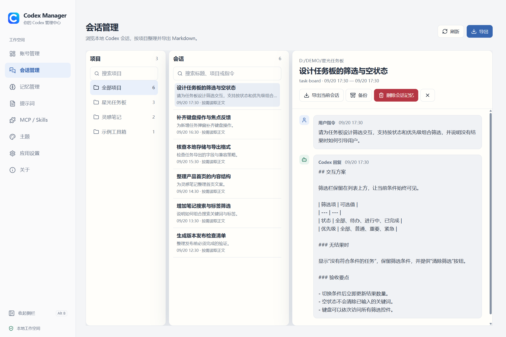

导出内容由你决定：

| 导出范围 | 包含什么 | 适合什么场景 |
| --- | --- | --- |
| **仅用户指令** | 用户消息 | 回顾需求、整理指令集 |
| **用户 + AI** | 用户消息与 AI 回复 | 交接记录、知识笔记 |
| **包含工具** | 对话，以及 AI 回复关联的工具调用和结果 | 开发复盘、问题排查 |
| **全部原始记录** | 追加系统、开发者、推理等原始记录 | 深入检查本地会话记录 |

用户消息与 AI 回复可独立选择；工具调用和结果随所属 AI 回复导出。也可以导出当前会话或按项目整理，避免手动逐段复制。

<details>
<summary>📄 查看 Markdown 导出选项</summary>

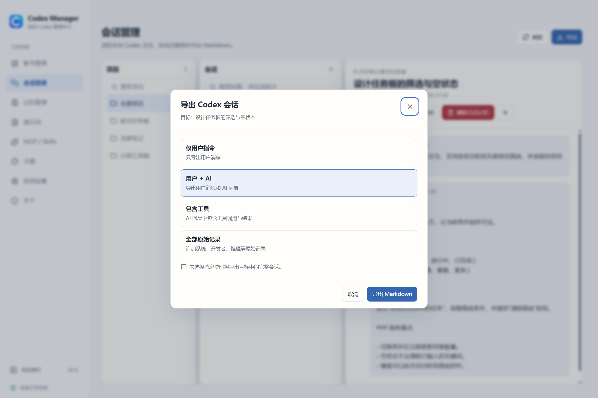

完整原始记录可能包含指令、项目路径、命令输出等内容，对外分享前请检查导出文件。

</details>

此外，会话页提供 **删除会话记忆、删除预览和备份恢复**。浏览与导出不会修改源会话；确认删除会修改本地 Session 文件，操作前请阅读预览中的影响范围。

## 🧠 记忆管理，让长期上下文看得见、改得动

将分散的本地记忆整理成可以阅读和维护的文件工作台：从摘要、长期规则，到会话总结和人工补充，按类别查看、按内容搜索。

- **分类与全文搜索**：根据标题、路径或正文定位需要的记忆。
- **阅读与原文切换**：查看 Markdown 效果，也能核对源文件。
- **编辑与维护**：新增、编辑、删除和导出本地记忆。
- **备份与恢复**：修改前自动备份，保留恢复入口。

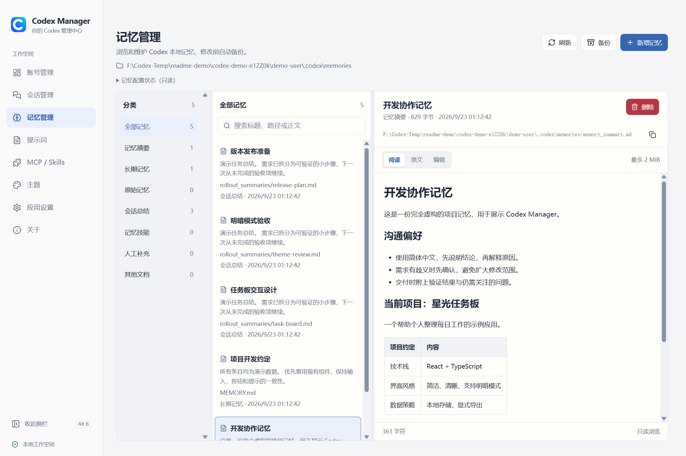

## ✍️ 提示词管理，让好用的指令持续积累

把代码审查、需求梳理、文档检查等工作指令保存在一起，任务开始前快速找到合适的模板。

支持读取本机当前指令、搜索模板、编辑和阅读预览、历史版本，以及 JSON 导入导出。内置模板保留来源信息，便于追溯和判断适用场景。

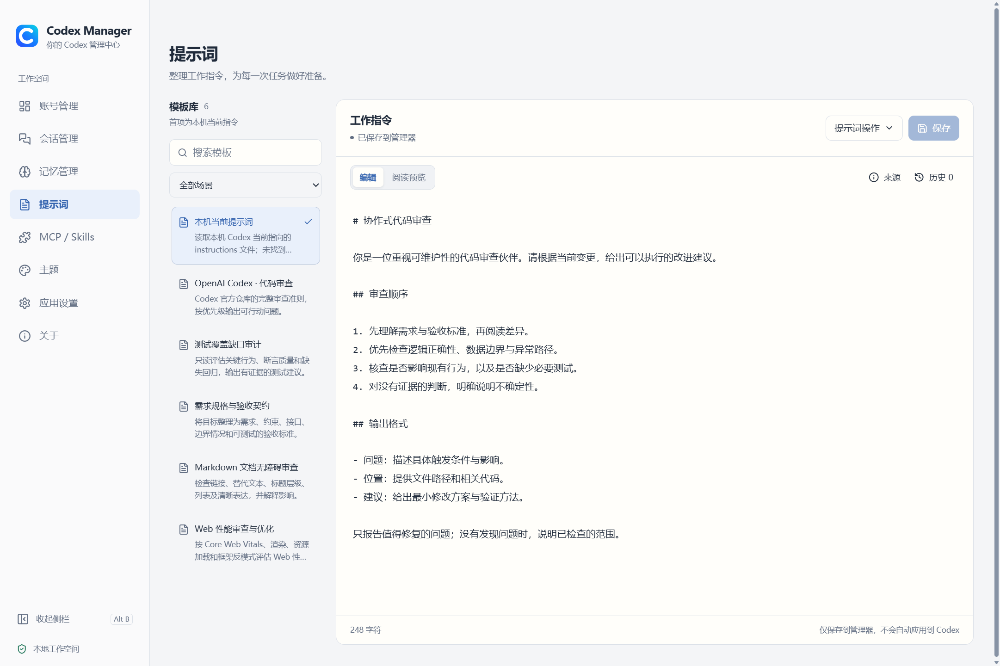

**保存提示词会写入管理器，不会自动覆盖 Codex 的指令文件。** 你可以先整理、比较和修改，再决定如何用于自己的任务。

## 🧩 MCP 与 Skills，集中整理工具和技能

### MCP 配置

查看 MCP 名称、传输方式、启用状态与超时设置；支持新增、编辑、删除、JSON / TOML 导入导出，以及备份、差异查看和回滚。

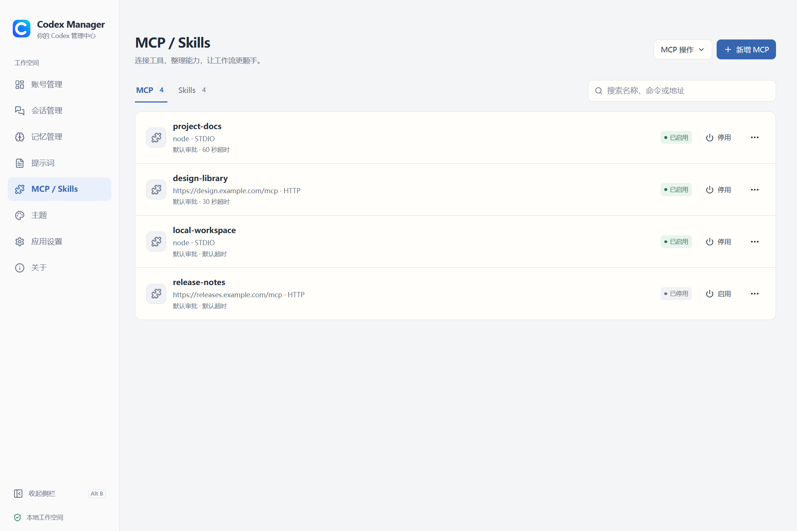

### Skills 管理

扫描本地技能，阅读 `SKILL.md`，查看来源范围与状态；支持启停、导入文件夹或单 Skill ZIP、选中导出。导入和导出本身不会执行 Skill 脚本。

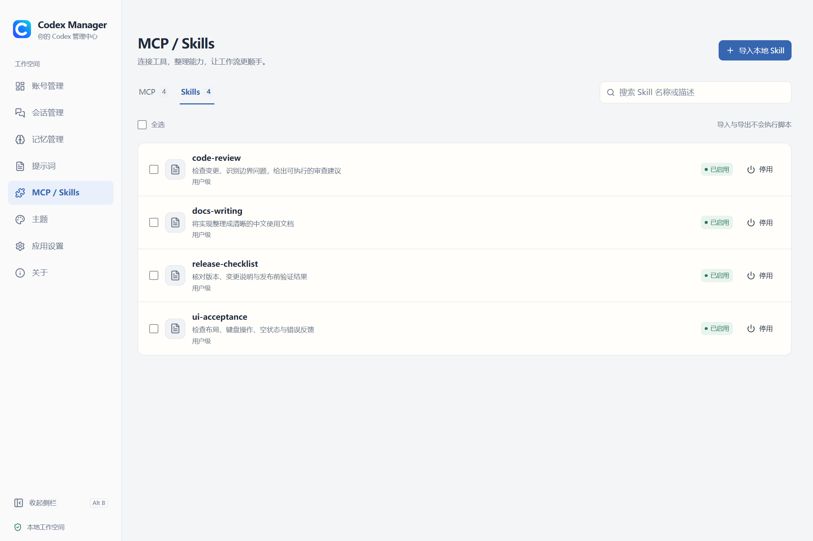

<details>
<summary>配置会写到哪里？</summary>

MCP 编辑写入用户级 `config.toml`，启停配置不代表 MCP 服务已经启动或连接成功。写入前会备份；TOML 重新序列化可能改变注释与排版。脱敏导出用于分享配置结构，不是完整凭据备份。

Skills 按应用识别的用户级和当前工作目录范围扫描；“项目级”与启动时的工作目录有关，并非会话页当前选中的项目。

</details>

## 🎨 主题馆，为每一种专注找到自己的风景

内置 **20 组主题，每组都有浅色与深色外观**。从极客黑客、赛博科幻，到自然人文、萌宠陪伴，先预览，再选择适合自己的工作氛围。


支持主题搜索与分类、首页和任务页预览、主题包导出，以及连接 Codex 后的外观备份、应用和恢复。部分主题带轻动效，并遵循系统的“减少动态效果”偏好。

下面按完整 HTML 画廊的顺序展示全部主题。点击图片查看浅色大图，点击“深色效果”查看同一主题的深色外观。

<table>
  <tr>
    <td width="50%" align="center">
      <strong>小果与大果 · 并肩小基地</strong><br />
      <a href="docs/theme-gallery/visual-1/fruit-base-light-home-1280.webp">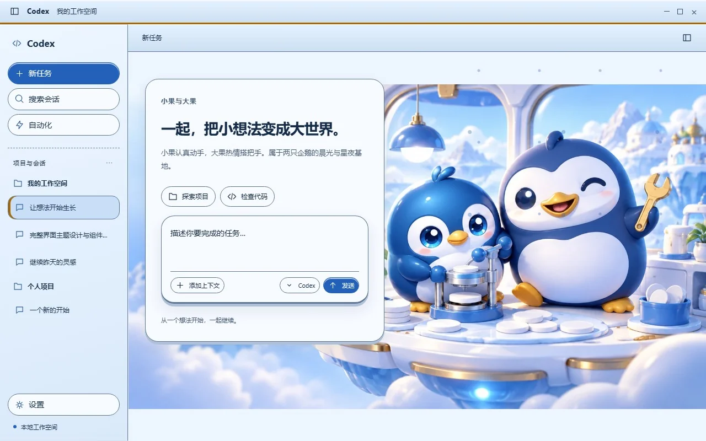</a><br />
      <a href="docs/theme-gallery/visual-1/fruit-base-light-home-1280.webp">浅色效果</a> · <a href="docs/theme-gallery/visual-1/fruit-base-dark-home-1280.webp">深色效果</a>
    </td>
    <td width="50%" align="center">
      <strong>噜噜与噜妹 · 慢半拍搭档</strong><br />
      <a href="docs/theme-gallery/visual-1/lulu-duo-light-home-1280.webp">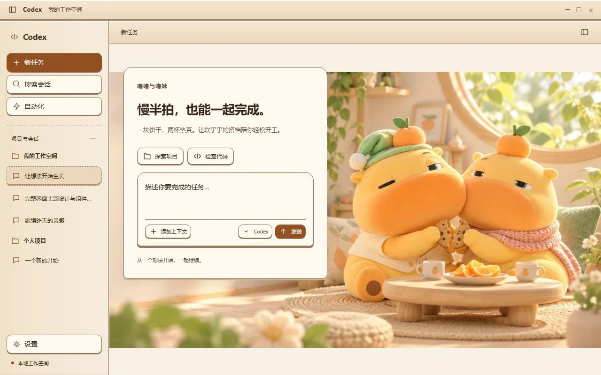</a><br />
      <a href="docs/theme-gallery/visual-1/lulu-duo-light-home-1280.webp">浅色效果</a> · <a href="docs/theme-gallery/visual-1/lulu-duo-dark-home-1280.webp">深色效果</a>
    </td>
  </tr>
  <tr>
    <td width="50%" align="center">
      <strong>吉伊卡哇 · 小小冒险队</strong><br />
      <a href="docs/theme-gallery/visual-1/chiikawa-camp-light-home-1280.webp">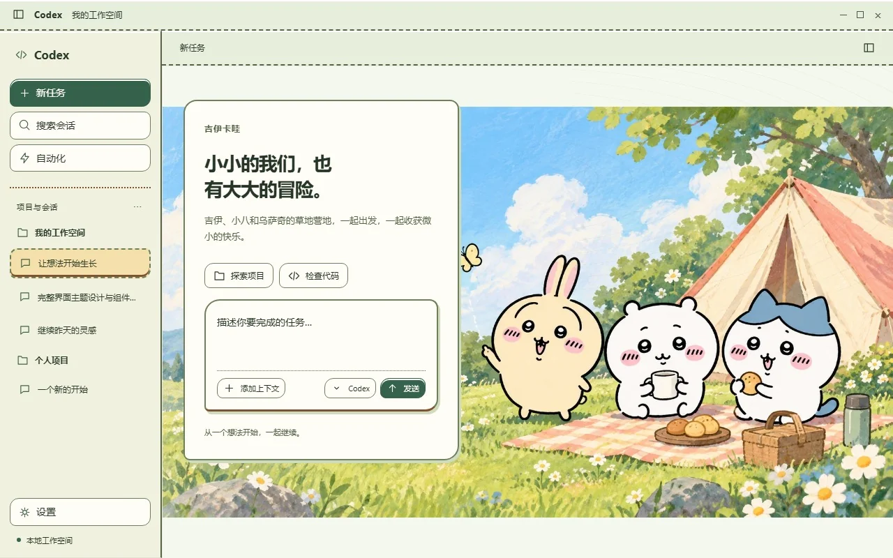</a><br />
      <a href="docs/theme-gallery/visual-1/chiikawa-camp-light-home-1280.webp">浅色效果</a> · <a href="docs/theme-gallery/visual-1/chiikawa-camp-dark-home-1280.webp">深色效果</a>
    </td>
    <td width="50%" align="center">
      <strong>LABUBU · 怪趣森林</strong><br />
      <a href="docs/theme-gallery/visual-1/labubu-forest-light-home-1280.webp">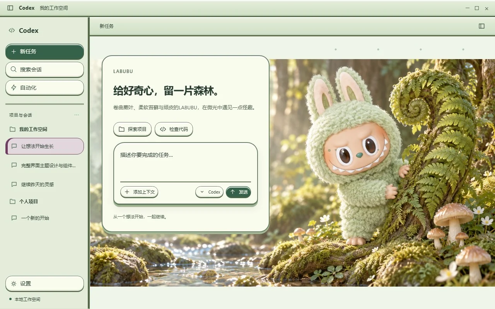</a><br />
      <a href="docs/theme-gallery/visual-1/labubu-forest-light-home-1280.webp">浅色效果</a> · <a href="docs/theme-gallery/visual-1/labubu-forest-dark-home-1280.webp">深色效果</a>
    </td>
  </tr>
  <tr>
    <td width="50%" align="center">
      <strong>龙猫 · 森林候车站</strong><br />
      <a href="docs/theme-gallery/visual-1/totoro-stop-light-home-1280.webp">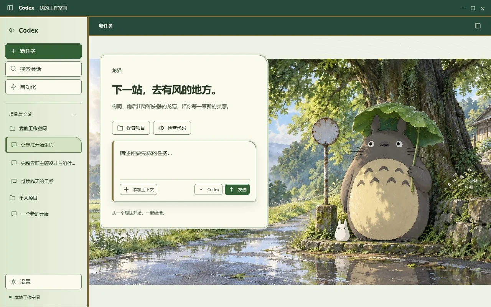</a><br />
      <a href="docs/theme-gallery/visual-1/totoro-stop-light-home-1280.webp">浅色效果</a> · <a href="docs/theme-gallery/visual-1/totoro-stop-dark-home-1280.webp">深色效果</a>
    </td>
    <td width="50%" align="center">
      <strong>千与千寻 · 海上列车</strong><br />
      <a href="docs/theme-gallery/visual-1/sea-train-light-home-1280.webp">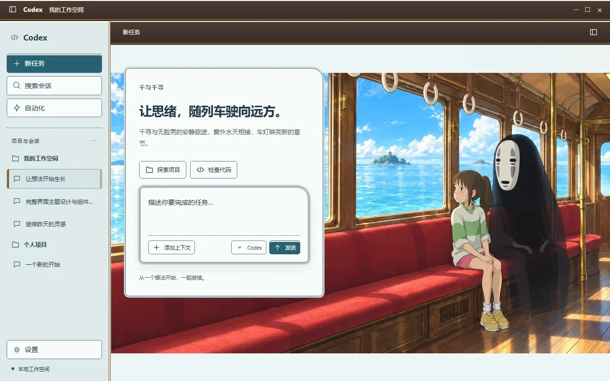</a><br />
      <a href="docs/theme-gallery/visual-1/sea-train-light-home-1280.webp">浅色效果</a> · <a href="docs/theme-gallery/visual-1/sea-train-dark-home-1280.webp">深色效果</a>
    </td>
  </tr>
  <tr>
    <td width="50%" align="center">
      <strong>哈尔 · 云上城堡</strong><br />
      <a href="docs/theme-gallery/visual-1/cloud-castle-light-home-1280.webp">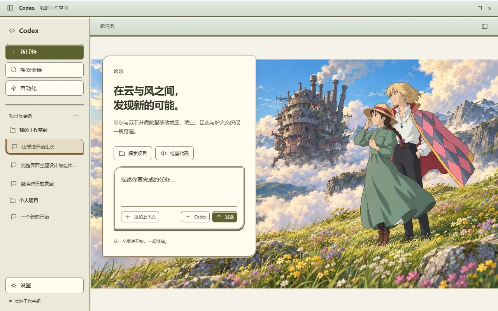</a><br />
      <a href="docs/theme-gallery/visual-1/cloud-castle-light-home-1280.webp">浅色效果</a> · <a href="docs/theme-gallery/visual-1/cloud-castle-dark-home-1280.webp">深色效果</a>
    </td>
    <td width="50%" align="center">
      <strong>像素开发部</strong><br />
      <a href="docs/theme-gallery/visual-1/pixel-studio-light-home-1280.webp">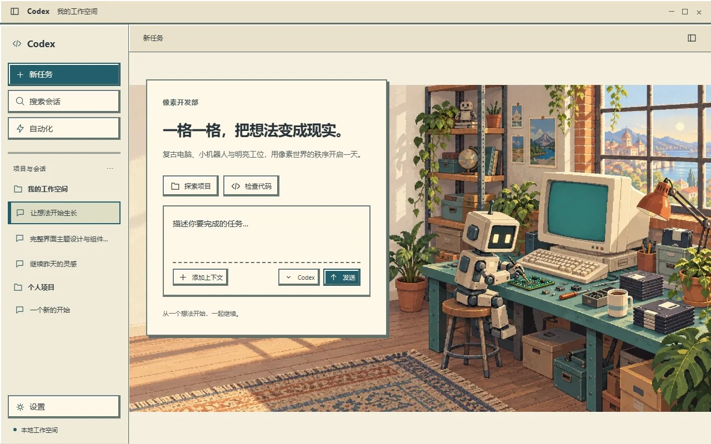</a><br />
      <a href="docs/theme-gallery/visual-1/pixel-studio-light-home-1280.webp">浅色效果</a> · <a href="docs/theme-gallery/visual-1/pixel-studio-dark-home-1280.webp">深色效果</a>
    </td>
  </tr>
  <tr>
    <td width="50%" align="center">
      <strong>透明机核</strong><br />
      <a href="docs/theme-gallery/visual-1/crystal-core-light-home-1280.webp">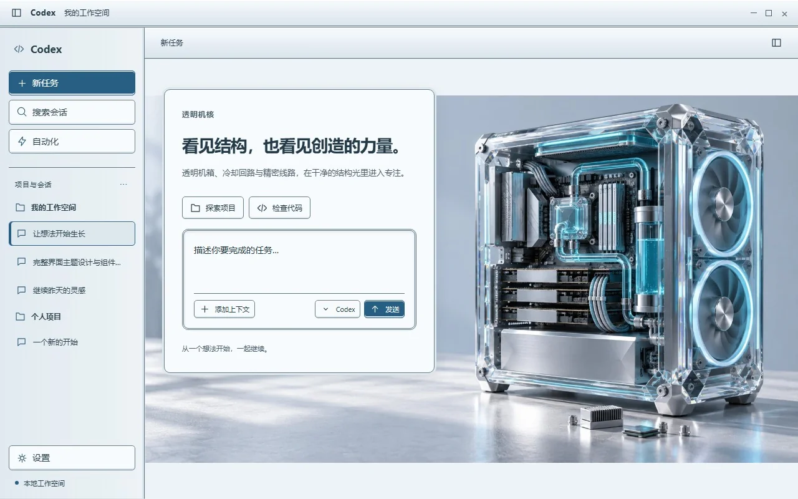</a><br />
      <a href="docs/theme-gallery/visual-1/crystal-core-light-home-1280.webp">浅色效果</a> · <a href="docs/theme-gallery/visual-1/crystal-core-dark-home-1280.webp">深色效果</a>
    </td>
    <td width="50%" align="center">
      <strong>零日终端</strong><br />
      <a href="docs/theme-gallery/visual-1/zero-day-light-home-1280.webp">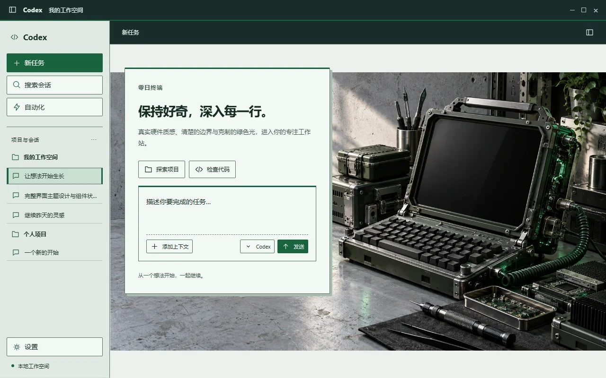</a><br />
      <a href="docs/theme-gallery/visual-1/zero-day-light-home-1280.webp">浅色效果</a> · <a href="docs/theme-gallery/visual-1/zero-day-dark-home-1280.webp">深色效果</a>
    </td>
  </tr>
  <tr>
    <td width="50%" align="center">
      <strong>霓虹疾行</strong><br />
      <a href="docs/theme-gallery/visual-1/neon-rider-light-home-1280.webp">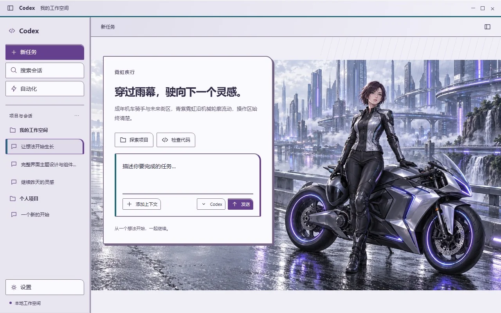</a><br />
      <a href="docs/theme-gallery/visual-1/neon-rider-light-home-1280.webp">浅色效果</a> · <a href="docs/theme-gallery/visual-1/neon-rider-dark-home-1280.webp">深色效果</a>
    </td>
    <td width="50%" align="center">
      <strong>苔原松风</strong><br />
      <a href="docs/theme-gallery/visual-1/pine-retreat-light-home-1280.webp">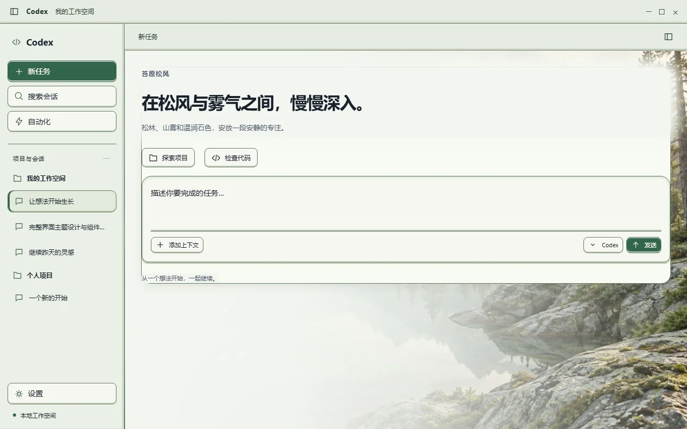</a><br />
      <a href="docs/theme-gallery/visual-1/pine-retreat-light-home-1280.webp">浅色效果</a> · <a href="docs/theme-gallery/visual-1/pine-retreat-dark-home-1280.webp">深色效果</a>
    </td>
  </tr>
  <tr>
    <td width="50%" align="center">
      <strong>潮汐来信</strong><br />
      <a href="docs/theme-gallery/visual-1/tidal-letter-light-home-1280.webp">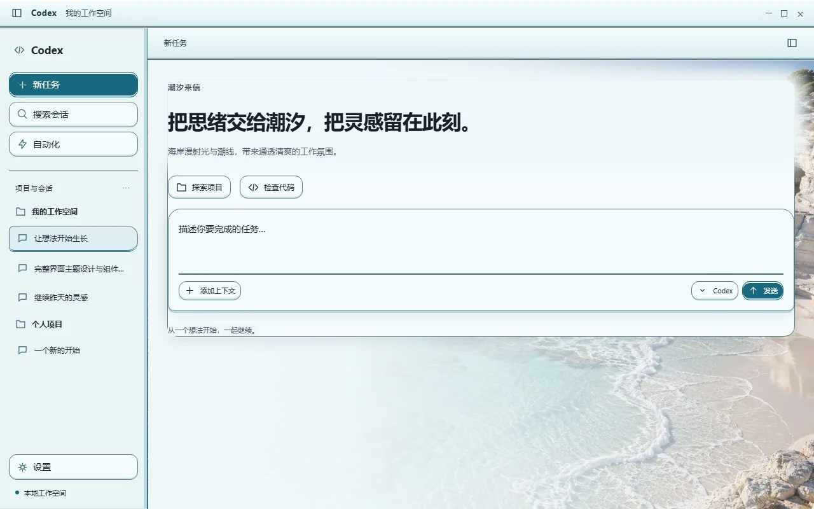</a><br />
      <a href="docs/theme-gallery/visual-1/tidal-letter-light-home-1280.webp">浅色效果</a> · <a href="docs/theme-gallery/visual-1/tidal-letter-dark-home-1280.webp">深色效果</a>
    </td>
    <td width="50%" align="center">
      <strong>纸上山河</strong><br />
      <a href="docs/theme-gallery/visual-1/ink-landscape-light-home-1280.webp">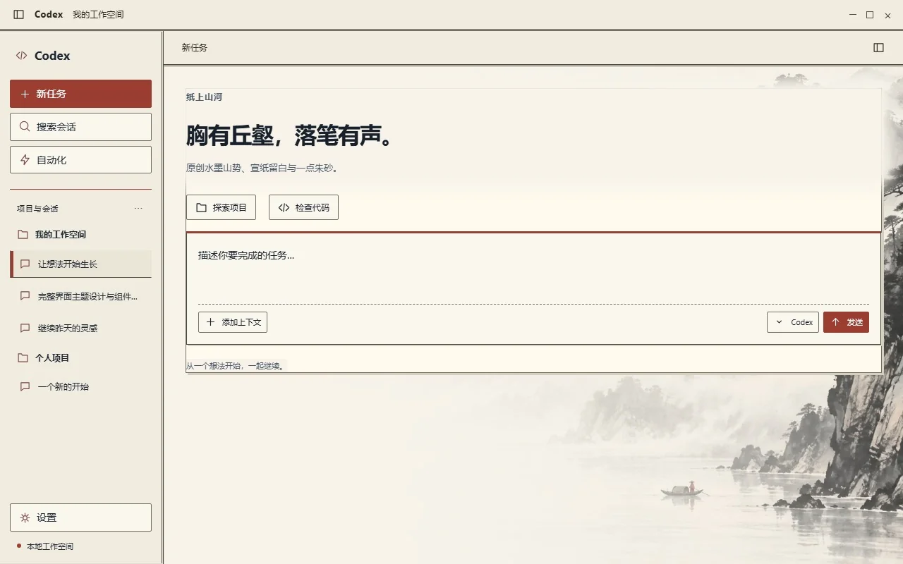</a><br />
      <a href="docs/theme-gallery/visual-1/ink-landscape-light-home-1280.webp">浅色效果</a> · <a href="docs/theme-gallery/visual-1/ink-landscape-dark-home-1280.webp">深色效果</a>
    </td>
  </tr>
  <tr>
    <td width="50%" align="center">
      <strong>星港远航</strong><br />
      <a href="docs/theme-gallery/visual-1/orbital-harbor-light-home-1280.webp">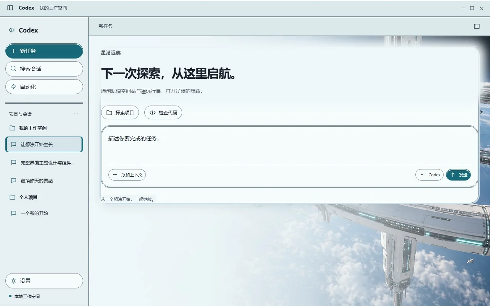</a><br />
      <a href="docs/theme-gallery/visual-1/orbital-harbor-light-home-1280.webp">浅色效果</a> · <a href="docs/theme-gallery/visual-1/orbital-harbor-dark-home-1280.webp">深色效果</a>
    </td>
    <td width="50%" align="center">
      <strong>霓虹雨巷</strong><br />
      <a href="docs/theme-gallery/visual-1/neon-rain-light-home-1280.webp">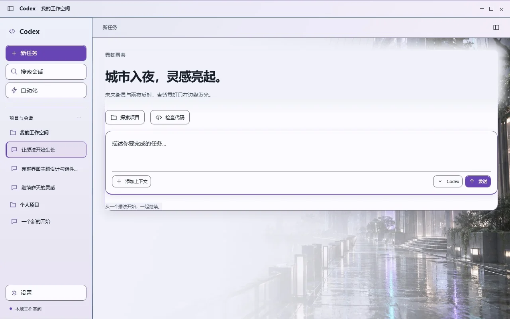</a><br />
      <a href="docs/theme-gallery/visual-1/neon-rain-light-home-1280.webp">浅色效果</a> · <a href="docs/theme-gallery/visual-1/neon-rain-dark-home-1280.webp">深色效果</a>
    </td>
  </tr>
  <tr>
    <td width="50%" align="center">
      <strong>浮岛信使</strong><br />
      <a href="docs/theme-gallery/visual-1/floating-courier-light-home-1280.webp">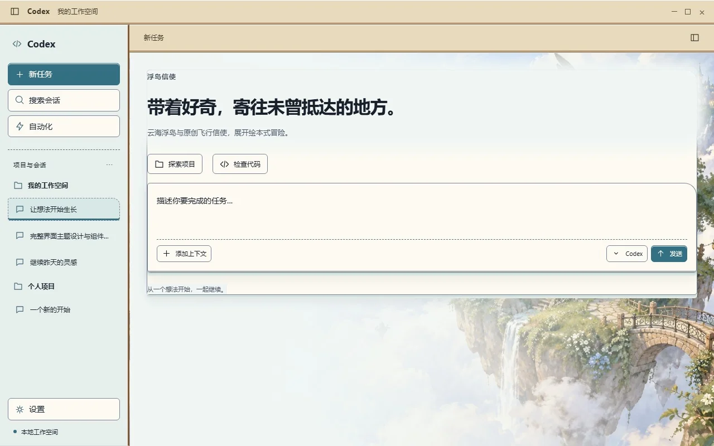</a><br />
      <a href="docs/theme-gallery/visual-1/floating-courier-light-home-1280.webp">浅色效果</a> · <a href="docs/theme-gallery/visual-1/floating-courier-dark-home-1280.webp">深色效果</a>
    </td>
    <td width="50%" align="center">
      <strong>绒云小筑</strong><br />
      <a href="docs/theme-gallery/visual-1/cloud-cottage-light-home-1280.webp">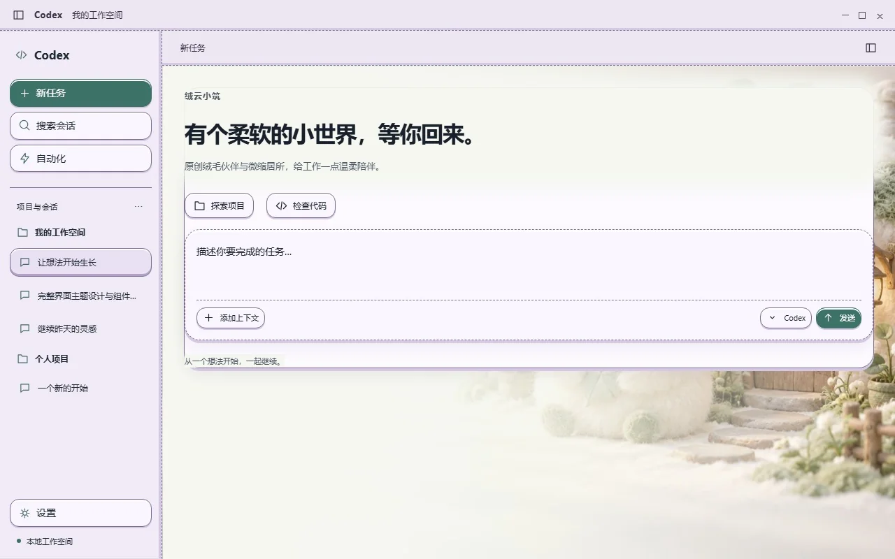</a><br />
      <a href="docs/theme-gallery/visual-1/cloud-cottage-light-home-1280.webp">浅色效果</a> · <a href="docs/theme-gallery/visual-1/cloud-cottage-dark-home-1280.webp">深色效果</a>
    </td>
  </tr>
  <tr>
    <td width="50%" align="center">
      <strong>晴空绘旅</strong><br />
      <a href="docs/theme-gallery/visual-1/skyward-journal-light-home-1280.webp">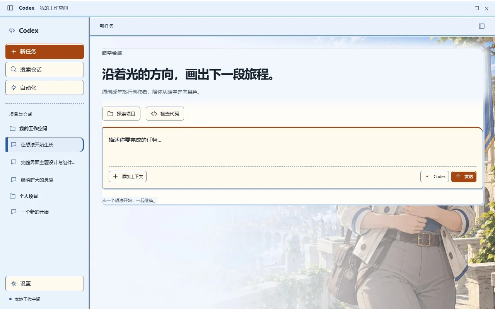</a><br />
      <a href="docs/theme-gallery/visual-1/skyward-journal-light-home-1280.webp">浅色效果</a> · <a href="docs/theme-gallery/visual-1/skyward-journal-dark-home-1280.webp">深色效果</a>
    </td>
    <td width="50%" align="center">
      <strong>月下弦歌</strong><br />
      <a href="docs/theme-gallery/visual-1/moonlit-serenade-light-home-1280.webp">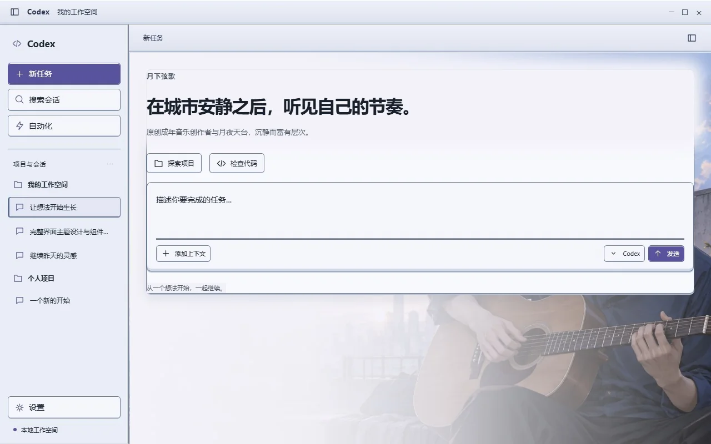</a><br />
      <a href="docs/theme-gallery/visual-1/moonlit-serenade-light-home-1280.webp">浅色效果</a> · <a href="docs/theme-gallery/visual-1/moonlit-serenade-dark-home-1280.webp">深色效果</a>
    </td>
  </tr>
</table>

以上均为同引擎的 **隔离示例预览**，实际 Codex 布局取决于客户端版本。应用主题需要受支持的本机连接；请按界面提示连接并保留备份。

**完整 HTML 画廊**：下载仓库后，在浏览器中打开 [docs/theme-gallery/review.html](docs/theme-gallery/review.html)。可切换浅色 / 深色、首页 / 任务页 / 设置 / 菜单与弹窗，以及不同窗口尺寸；请保留同目录下的 `visual-1/` 图片文件夹。

<a id="quick-start"></a>

## 🚀 快速开始

### 安装包

在 [GitHub Releases](https://github.com/pen9un/codex-manager/releases) 下载适合设备的安装包：

| 系统 | 架构 | 文件名中的标记 | 格式 |
| --- | --- | --- | --- |
| Windows | x64 | `Windows-x64` | `.exe` 安装程序 |
| macOS · Intel | x64 | `macOS-x64` | `.dmg`、`.zip` |
| macOS · Apple Silicon | arm64 | `macOS-arm64` | `.dmg`、`.zip` |
| Linux | x64 | `Linux-x86_64` / `Linux-amd64` | `.AppImage` / `.deb` |

文件名格式为 `Codex-Manager-<版本>-<系统>-<架构>.<扩展名>`。每次自动发布都附带 `SHA256SUMS.txt`，用于核对下载文件的 SHA-256。

如果 Releases 暂无安装包，可以从源码启动，或到 [Actions](https://github.com/pen9un/codex-manager/actions/workflows/ci.yml) 下载成功构建的 `release-bundle`（需要登录 GitHub）。Windows 安装器尚无开发者证书签名；macOS 采用 ad-hoc 签名，尚未进行 Apple 公证。自动化构建不替代安装、升级及桌面功能的实机验收。

### 从源码运行

准备 **Node.js 22.12+ 和 pnpm 10**，在终端执行：

```powershell
git clone https://github.com/pen9un/codex-manager.git
cd codex-manager
pnpm install --frozen-lockfile
pnpm run dev
```

首次启动后，你可以任选一个入口开始：

1. **管理账号**：导入本机登录，确认预览后查询用量；需要跨终端使用时选中导出。
2. **整理会话**：选择项目与会话，点击“导出当前会话”，选择需要的内容范围。
3. **维护记忆**：搜索并阅读本地记忆，按需编辑，修改前会自动备份。
4. **尝试主题**：打开主题馆预览明暗效果；连接 Codex 后再应用。

<a id="faq"></a>

## ❓ 常见问题

### 这是 OpenAI 官方软件吗？

不是。Codex Manager 是社区维护的开源工具，与 OpenAI 没有隶属、背书或官方支持关系。使用它管理你有权访问的本地 Codex 账号和数据。

### 账号导出后，其他终端能直接使用吗？

目标终端可以导入 JSON 并切换到该账号，最终是否可用取决于凭据有效性、账号权益和客户端兼容性。账号导出只传递认证信息，不迁移项目、会话或记忆，也不提供 ChatGPT 网页登录。

管理器不会自动续期 OAuth 或轮换 refresh token。出现凭据过期、HTTP 401 时，请在原客户端重新登录，再导入最新凭据。

### 数据保存在什么地方？需要联网吗？

账号、设置和提示词保存在本机应用数据目录，通过 Electron `safeStorage` 加密；Windows 默认位于 `%APPDATA%\Codex-Manager`。Codex 数据读取 `CODEX_HOME`，未设置时使用用户目录下的 `.codex`。

查看已有会话、记忆和主题预览使用本地数据；用量查询需要联网，也支持在设置中配置代理。默认每 5 分钟自动查询用量，可以关闭或调整。账号 JSON 导出是明文文件，不具备保险库的加密保护。

### 账号切换、记忆编辑和主题应用会修改什么？

账号切换会备份并替换本机 `auth.json`；记忆编辑和确认后的会话记忆删除会修改对应本地文件，并保留备份。主题通过受支持的本机连接应用外观，不修改官方安装包。涉及文件变更时，建议先结束正在运行的相关任务。

### 为什么额度、会话或主题可能暂时不可用？

用量接口、会话格式和主题连接都受 Codex 版本影响。出现问题时，请附上系统版本、Codex 版本、管理器版本及脱敏后的复现步骤到 [Issues](https://github.com/pen9un/codex-manager/issues)。不要上传账号导出文件或完整私人会话。

## 🛠️ 开发与构建

基于 **Electron + React + TypeScript**，使用 electron-vite 构建、Vitest 测试、electron-builder 打包。

```powershell
# 类型检查、自动化测试与生产构建
pnpm run typecheck
pnpm run test:ci
pnpm run build

# 构建 Windows 安装包
pnpm run build:win

# 在 macOS 上构建本机架构的 DMG 和 ZIP
pnpm run build:mac

# 在 Linux 上构建 x64 AppImage 和 DEB
pnpm run build:linux
```

完整构建入口为 `scripts/build-windows.bat`，包含锁定依赖安装、测试、生产构建和 Windows 打包：

```powershell
cmd /c scripts\build-windows.bat
```

产物输出到 `releases/`。CI 使用 Windows x64、macOS Intel、macOS Apple Silicon 和 Linux x64 四个原生构建环境，执行测试、类型检查、生产构建和打包，最后验证全部安装包并生成校验清单。

### 自动发布 Release

**手动发布**：打开 [发布 Release 工作流](https://github.com/pen9un/codex-manager/actions/workflows/release.yml)，点击 **Run workflow**，选择 `main`，再点击绿色的 **Run workflow**。工作流读取所选分支本次提交的 `package.json` 版本，所有平台通过后自动创建对应标签和 Release，无需先在本地打标签。首次发布当前版本可直接使用此入口；后续发布先更新版本号并提交。

**标签触发发布**：将 `package.json` 更新为目标版本并提交后，推送同名 `v` 标签也可触发发布。例如版本为 `2.0.2` 时：

```bash
git tag v2.0.2
git push origin main
git push origin v2.0.2
```

标签必须与 `package.json` 一致。全部平台构建成功后，工作流自动创建 Release 草稿、上传 7 个安装包及校验清单，再公开发布；版本说明会附带 GitHub 自动生成的变更记录。`v2.1.0-beta.1` 这类版本会标记为预发布。

普通提交和手动运行 **CI** 只生成 Actions 构建产物；手动运行 **发布 Release** 会公开发版。已有版本标签必须指向本次构建提交，公开发布过的版本不会被工作流覆盖。此流程使用仓库自带的 `GITHUB_TOKEN`，无需额外配置个人访问令牌。详细操作与失败重试见 [GitHub 发布指南](docs/GitHub发布指南-20260923.md)。这里的自动发布不包含应用内自动更新。

<details>
<summary>📁 目录结构与截图复现</summary>

```text
src/main/          主进程：账号、会话、记忆、扩展与主题服务
src/preload/       渲染器可调用的接口
src/renderer/src/  React 页面和样式
src/shared/        类型、品牌与共享数据
resources/         图标、主题资源和第三方声明
tests/             自动化测试与隔离 Electron 验证
test/              仍在执行的历史测试
scripts/           构建和辅助工具
docs/images/       README 软件截图
docs/theme-gallery/ 完整主题展示页
```

本页截图由真实生产构建生成，不依赖个人账号。复现前先执行 `pnpm run build`，再在 PowerShell 中运行：

```powershell
$env:README_DEMO_TEMP = Join-Path $env:PUBLIC 'CodexManagerDemo'
pnpm exec electron tests/readme_screenshots.cjs
```

脚本创建独立的模拟用户目录、Codex 数据目录和应用保险库，阻断网络与真实客户端连接，将 12 张截图输出至 `docs/images/`。临时目录可在脚本退出后自行清理。

</details>

维护者文档：[GitHub 发布指南](docs/GitHub发布指南-20260923.md) · [开源发布检查清单](docs/开源发布检查清单-20260922.md)

## 🤝 参与贡献

欢迎提交问题、改善文档、补充测试或贡献功能。开始前请阅读 [贡献指南](.github/CONTRIBUTING.md) 与 [行为准则](.github/CODE_OF_CONDUCT.md)；安全问题请参考 [安全报告说明](.github/SECURITY.md)。

提交代码前运行 `pnpm run typecheck`、`pnpm run test:ci` 和 `pnpm run build`，使用合成数据验证涉及账号、会话和记忆的变更。

## 📄 许可证与致谢

本项目自身代码使用 [MIT License](LICENSE)。内置主题、主题引擎和提示词模板保留各自的来源与许可证；第三方内容的权利不因打包而改变。相关说明见 `resources/skins/`、`resources/theme-engine/` 和 `src/shared/vendor/` 中的许可证及来源记录。

感谢上游项目、素材贡献者，以及每一位报告问题、改进体验的使用者。

## ❤️ 支持项目

如果 Codex Manager 帮你省下了整理账号、查找会话或维护配置的时间，欢迎点一个 **Star ⭐**，或分享给同样在使用 Codex 的朋友。具体的使用反馈和复现步骤，同样是对项目很有价值的支持。
